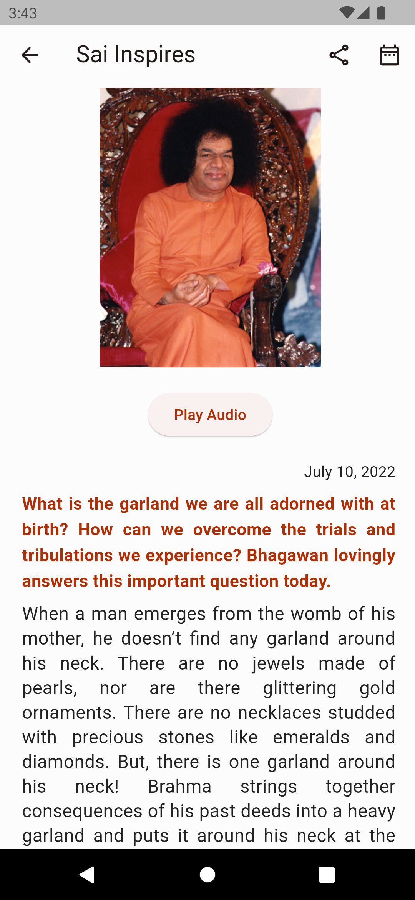
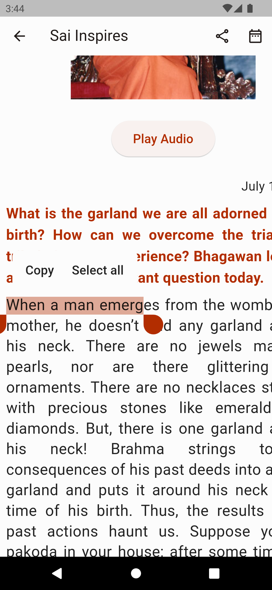
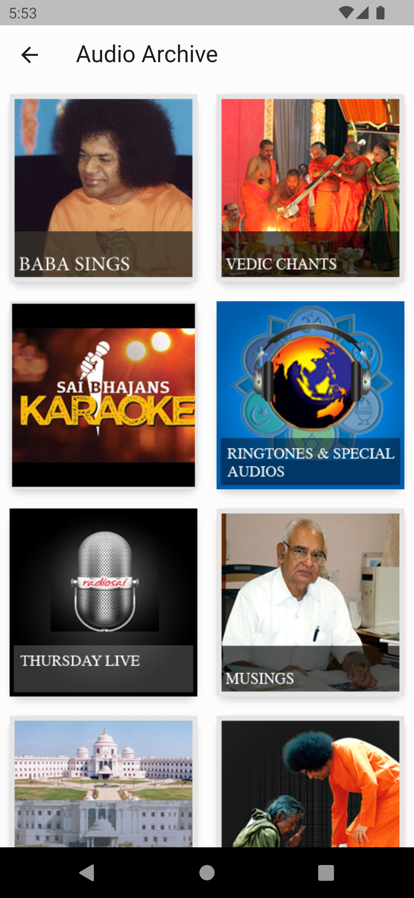
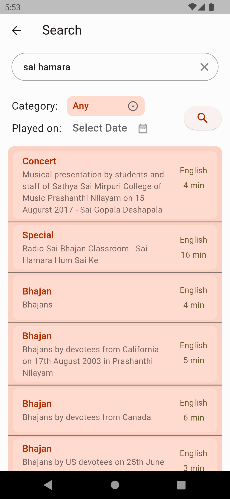
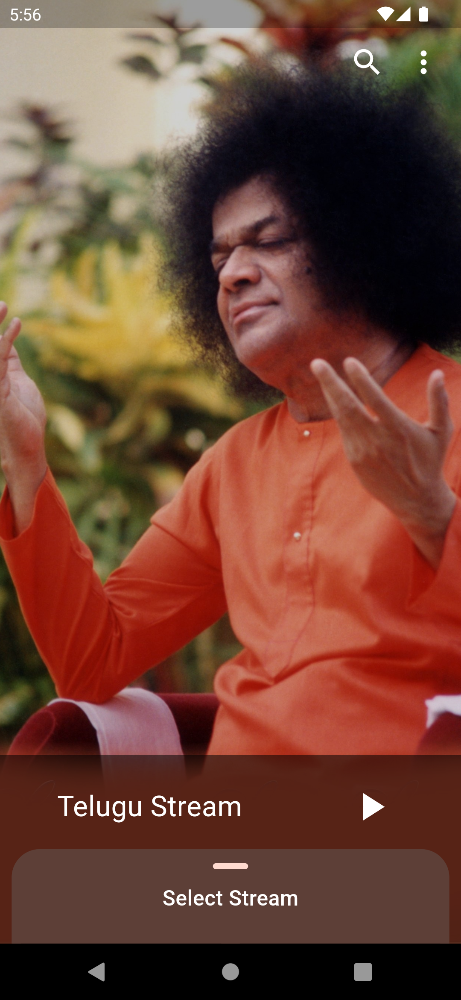
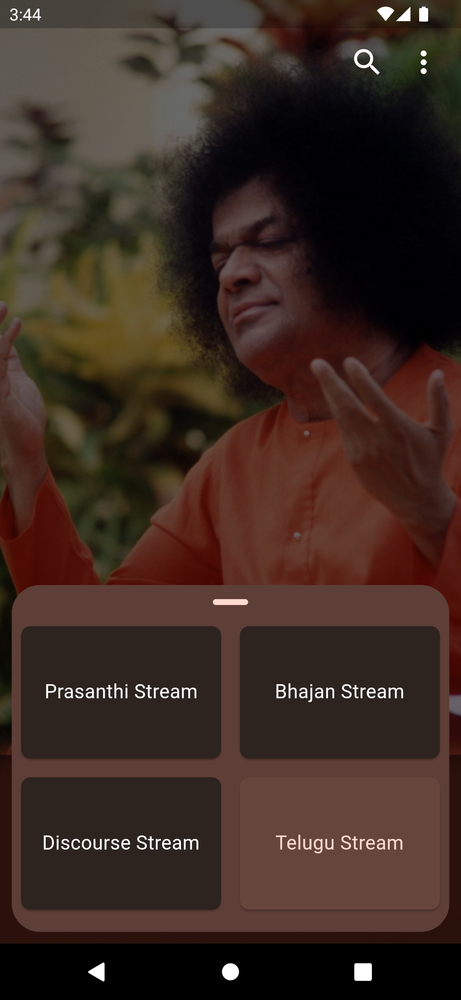
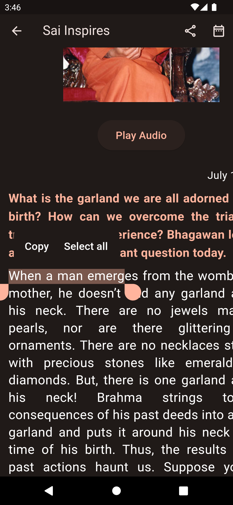
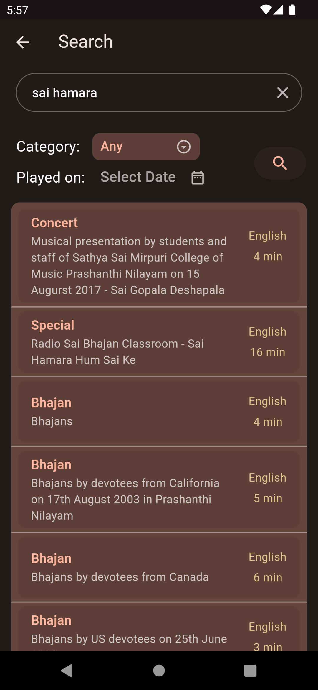
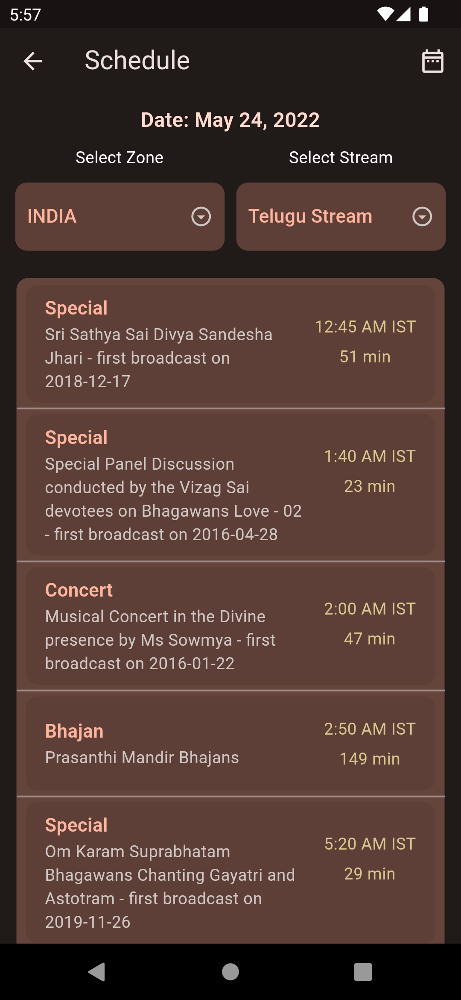

<p align="center">
    
</p>
<h1 align=center>Sai Voice</h1>
<p align=center>A radio player which streams audio from Radio Sai Global Harmony.</p>
<p align="center">
 <a href="https://radiosai.immadisairaj.dev">
    </img>
  </a>
  <a href="https://github.com/immadisairaj/radiosai/blob/main/LICENSE.md">
    
  </a>
  <a href="https://radiosai.immadisairaj.dev/privacy_policy.html">
    
  </a>
</p>
<br/>

Om Sri Sai Ram :pray:

Sai Voice is an audio app that streams audio data broadcasted by Radio Sai Global Harmony.

Download Links: [Google Play Store](https://play.google.com/store/apps/details?id=com.immadisairaj.radiosai) | [Apple Test Flight](https://testflight.apple.com/join/KuSOycYv)

| :warning: Internet is needed for the app to function properly. |
|-|

_*All the data inside the app is taken from [sssmediacentre.org](https://www.sssmediacentre.org)_

__Radio Streams include:__
- Prasanthi Stream
- Bhajan Stream
- Discourse Stream
- Telugu Stream

__Smooth:__ The app is built to keep a smooth user experience. One can change the streams they want to listen to with ease by just sliding the panel up and selecting the new stream.

__Seamless Listening:__ It is capable of running in the background until the app is removed from the process. Listen to your favourite radio stream with just one click after opening the app (an option to set the favourite stream at the start of the app)

__Media Control:__ It can handle the audio options from a handset to a headset, from lock screen notifications to earphones button click. It also pauses when another player starts and doesn't interrupt any incoming notifications.

__Dark Theme:__ The app also comes with dark theme. One can change the theme they want from settings.

__Split Screen:__ The app is suitable for split screen. Operate this app while doing work in a different app.

__Schedule:__ Look at the radio schedule of different streams from within the app. One can see and listen to the different media present in the schedule by clicking one them.

__Sai Inspires:__ Thought of the day by Sai Inspires is present inside the app. One can read it at any text size they want by zooming in. One can also share the content by clicking the copy icon (copies to clipboard). One can also view and save the image.

__Search:__ Searching through out the Radio Sai audio is now possible from the app. Once can search by filtering through category or streamed date. Listening to the audio from the search is also possible now in the app.

__Media Player:__ A new media player which is capable of playing the media seamlessly. Sharing the link to the media, adding/removing from playing queue, shuffling the queue, repeat mode, and other functions are present in the media player. Drawback of the player is the playing queue is cleared when radio is played or when the player is stopped.

__Free without ads:__ The app is free for all and will remain the same further. No ads are shown in the app. This is thanks to Radio Sai Global Harmony for providing the content without any charge. Like the Sai Organization, we believe in selfless service and do not expect anything in return.

__Open Source:__ We believe that there is nothing to hide and like you to experience the bliss of Swamy. So, the source code of the app is open-source and will remain the same in future.

__File Permissions:__ File write permission is requested only to save images from Sai Inspires. One can deny these permissions from the settings.

_*Special Thanks to Aman Achutan for the logo_

> "Sai Ram, and Happy Listening"
## Features

| Feature                            |  Android |   iOS  |
| -------                            | :-------:| :-----:|
| background audio                   | ✔️        | ✔️      |
| headset clicks                     | ✔️        | ✔️      |
| play/pause/seek                    | ✔️        | ✔️      |
| fast forward/rewind                | ✔️        | ✔️      |
| repeat/shuffle mode                | ✔️        | ✔️      |
| skip next/prev                     | ✔️        | ✔️      |
| notifications/control center       | ✔️        | ✔️      |
| light/dark theme                   | ✔️        | ✔️      |
| starting with fav stream           | ✔️        | ✔️      |
| sai inspires share/download        | ✔️        | ✔️      |
| share media links                  | ✔️        | ✔️      |
| splash screen/launch screen        | ✔️        | ✔️      |
| app links                          | ✔️        |        |

## Future Updates

_*I cannot guarantee any of the below. But, will try my best to include such features in future releases (if I can)_

- Add android auto support
- Add google chrome cast support

## Radio Player Flow

```
Stop State -> Play in app screen (user action) -> Play State
Stop State -> Change Radio Stream (user action) -> Changes Radio Stream -> Stop State
Play State -> Change Radio Stream (user action) -> Stop State -> Changes Radio Stream -> Play State
Play State -> Pause in app screen (user action) -> Stop State

Play State -> Pause in notification (user action) -> Pause State
Play State -> Stop in notification (user action) -> Stop State
```

## Motivation

I like to listen to various bhajans which made me fond of radio sai. I've installed the app (old) and kept listening to the radio that gave me peace. I felt the application UI/UX was not up to the mark. The audio stops in between and doesn't handle audio when I receive a call or play another media. That was the start of the idea to build an app that solves these problems. I started to collect resources from where the radio is broadcasted and finally reached the point to have a public release of the app. I referred to the radio sai app and its functionality while building this app.

>I feel this app solves the problems that I (and many others) face and would like to share this with all. It's one's choice to use whichever app is comfortable.

## Screenshots

### Light Theme
           

### Dark Theme
           

## Architecture

Most of the main features use bloc architecture using providers and streams. The usage of this architecture helps the app no to completely refresh but just helpful for updating the needed components smoothly.

```bash
lib
├───audio_service   # audio service related handlers
│   └── notifiers
├───bloc            # business logic files related to screens
│   ├───media
│   ├───radio
│   ├───radio_schedule
│   └───settings
├───constants       # constants
├───helper          # helper classes
├───screens         # all screens
│   ├── audio_archive
│   ├───media
│   ├───media_player
│   ├───radio
│   ├───sai_inspires
│   ├───radio_schedule
│   └───settings
│       └───general
└───widgets         # widgets related to screens
    ├───radio
    └───settings
```
_Above is generated using "tree" command inside lib/_

## OpenSource Libraries

__shared_preferenecs:__
used to store short data locally like: saving the radio stream while closing the app and displays the same on app start, display the favourite radio stream on app start; save the user preference app theme.

__sliding_up_panel:__
used to select a different radio stream by sliding up the panel.

__shimmer:__
used to show loading progress in the data loading screens

__internet_connection_checker:__
used to detect the internet status of the device

__just_audio & audio_service:__
the main base of the app helps play the audio seamlessly with media control. Thank you @ryanheise

_and many other open-source libraries._


Thanks to the Open Source community for providing such great libraries and framework which was very helpful in building the application.

## Privacy Policy

The Privacy Policy of the app is in the site: [radiosai.immadisairaj.dev/privacy_policy.html](https://radiosai.immadisairaj.dev/privacy_policy.html)

## License

This project is licensed under the GNU General Public License V2, see the [LICENSE.md](https://github.com/immadisairaj/radiosai/blob/main/LICENSE.md) for more details.
